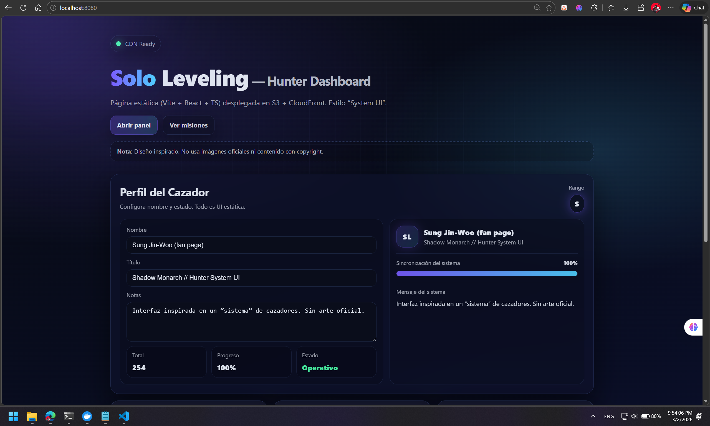
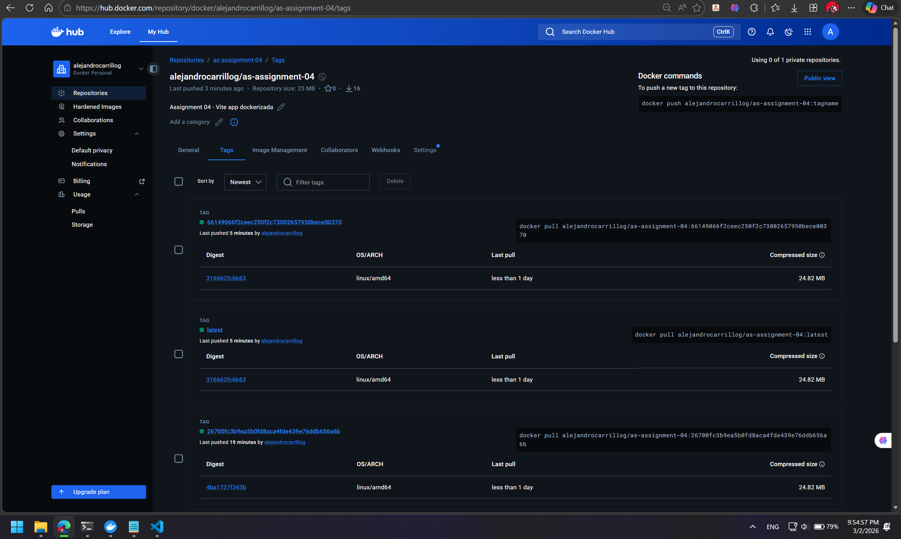
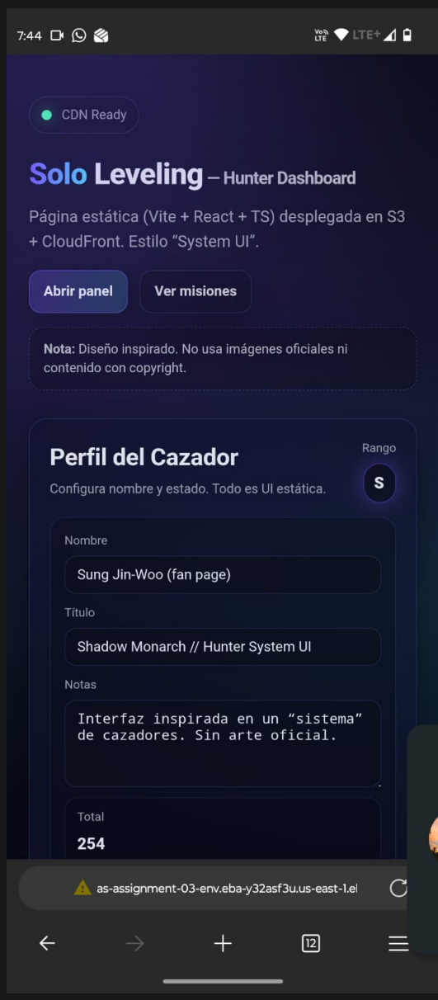
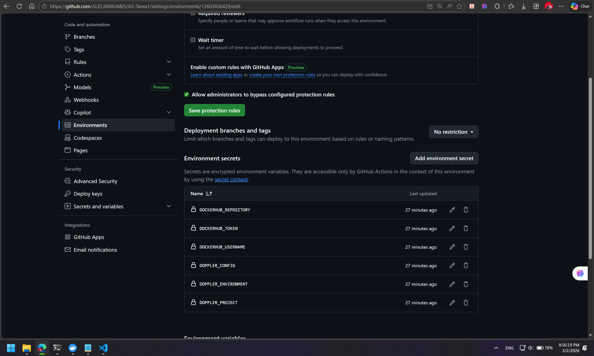
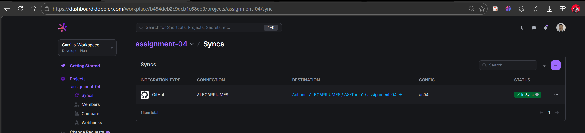
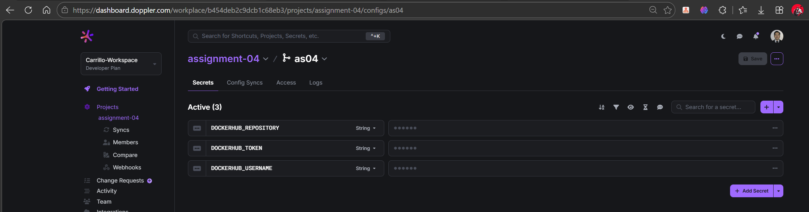
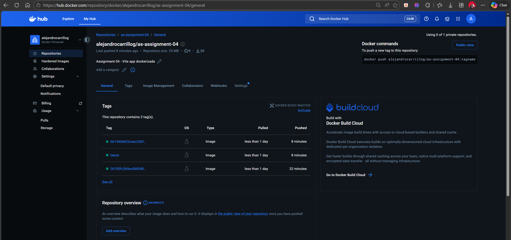

# AS-Tarea1 — Assignment 04 (Docker Hub + GitHub Actions + Doppler)

## Captura de la aplicación

## URL de Docker Hub
Repositorio: https://hub.docker.com/r/alejandrocarrillog/as-assignment-04

## Evidencia de tags en Docker Hub

## Pipeline (GitHub Actions)
En cada commit a la rama `assignment-04`, el workflow construye y publica la imagen Docker con:
- Tag `latest`
- Tag `<SHA del commit>`

Resultado: `latest` siempre apunta a la imagen más reciente y las anteriores quedan con su SHA.

